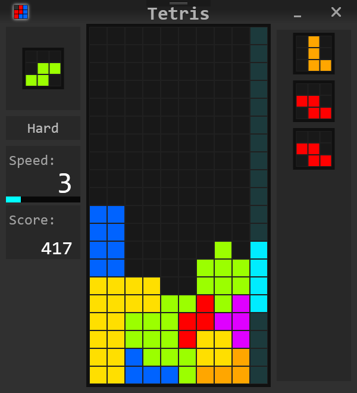

# Tetris
A simple Tetris game.  
You can play this using keyboard.
# Introduction
This is a simple project to practice wpf developing.  
It helps me to figure out how wpf draw UI and combine the code behind.  
I tried to do MVC design pattern, but I am not sure is it on the right track or not.  
Wish I can do better next time :)
# Scoring
You will get more point if clear more rows in a step.  
Also, total number of cleared rows in a game will increase point you get while clear rows.  
Force blocks down  1 tile will get 1 point. Fall to bottom immediately will get 2 point per tile.
More difficult more point, of course.  
# Read More...
If you find bugs, tell me please. I will try to handle it.  
If you can give me some suggestion, I would be appreciate.  
Hope you guys enjoy this.
